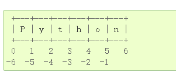

# Acwing-Python

## python 解释器

添加

    #！/usr/bin/env python3
    # -*- coding: utf-8 -*-

可以支持./运行

使用**ipython**可以进行补全操作

---

## python 速览

### 基础部分

“#” ： 注释

算术运算： `+`、`-`、`*`、`/`、`//`、`**`、`%`

字符串： `''` `""` `"""..."""` 或 `'''...'''`

### 字符串

#### 字符串运算：

`*` :表示重复

`+`: 表示合并  空格也可以合并（**统一用加号就行**）空格对于变量不行

    3  *  'un'  +  'ium'
    'unununium'

#### 字符串索引 :

正向和负向索引

    word  =  'Python'
    >>> word[0]  # character in position 0
    'P'
    >>> word[5]  # character in position 5
    'n'
    
    word[-1]  # last character
    'n'
    >>> word[-2]  # second-last character
    'o'
    >>> word[-6]
    'P'

#### 字符串切片：

前闭后开

    word[0:2]  # characters from position 0 (included) to 2 (excluded)
    'Py'
    >>> word[2:5]  # characters from position 2 (included) to 5 (excluded)
    'tho'

省略开始索引时，默认值为 0，省略结束索引时，默认为到字符串的结尾：

索引不可以越界

切片能自动处理越界问题

字符串不能修改，是immutable的，修改会报错

要生成不同字符串，只能新建一个

`len()` 返回字符串的长度

### 列表

    squares  =  [1,  4,  9,  16,  25]
    >>> squares
    [1, 4, 9, 16, 25]

列表也支持索引和切片

    squares[0]  # indexing returns the item1
    >>> squares[-1]
    25
    >>> squares[-3:]  # slicing returns a new list
    [9, 16, 25]

切片操作返回包含请求元素的新列表

    squares[:]
    [1, 4, 9, 16, 25]

列表也可以进行合并操作

    squares  +  [36,  49,  64,  81,  100]
    [1, 4, 9, 16, 25, 36, 49, 64, 81, 100]

与字符串 [immutable](https://docs.python.org/zh-cn/3/glossary.html#term-immutable) 不同, 列表是 [mutable](https://docs.python.org/zh-cn/3/glossary.html#term-mutable) 类型，其内容可以改变

    >>> cubes  =  [1,  8,  27,  65,  125]  # something's wrong here
    >>> 4  **  3  # the cube of 4 is 64, not 65!
    64
    >>> cubes[3]  =  64  # replace the wrong value
    >>> cubes
    [1, 8, 27, 64, 125]

`append()` 方法可以在列表结尾添加新元素:

string 没有append()操作

    >>> cubes.append(216)  # add the cube of 6
    >>> cubes.append(7  **  3)  # and the cube of 7
    >>> cubes
    [1, 8, 27, 64, 125, 216, 343]

为切片赋值会改变原来的值

    >>> letters  =  ['a',  'b',  'c',  'd',  'e',  'f',  'g']>>> letters
    ['a', 'b', 'c', 'd', 'e', 'f', 'g']
    >>> 修改切片的值
    >>> letters[2:5]  =  ['C',  'D',  'E']
    >>> letters['a', 'b', 'C', 'D', 'E', 'f', 'g']
    >>> 清除部分值
    >>> letters[2:5]  =  []
    >>> letters['a', 'b', 'f', 'g']
    >>> # 清空列表
    >>> letters[:]  =  []
    >>> letters[]

内置函数`len()` 也可以支持列表

    >>> letters  =  ['a',  'b',  'c',  'd']
    >>> len(letters)4

列表也可以进行一些嵌套操作

    >>> a  =  ['a',  'b',  'c']
    >>> n  =  [1,  2,  3]
    >>> x  =  [a,  n]
    >>> x
    [['a', 'b', 'c'], [1, 2, 3]]
    >>> x[0]
    ['a', 'b', 'c']
    >>> x[0][1]
    'b'

     print() 
    >>> i  =  256*256
    >>> print('The value of i is',  i)  # 字符串与变量拼接
    
    >>> a,  b  =  0,  1
    >>> while  a  <  100:   
            print(a,  end=',')  # 可以取消最后换行，以另一种方式结尾
            a,  b  =  b,  a+b
    
    0,1,1,2,3,5,8,13,21,34,55,89

深拷贝与浅拷贝

    # 浅拷贝可以看成一个引用，指向同一块地址，改变自己的时候也会改变原来的值
    # 深拷贝就是拷贝一份数据，修改以后不会影响原来内容
    
    # 浅拷贝
    x = [1,2]
    y = [3,4]
    a = [x, y]  ## [[1, 2], [3, 4]]
    b = a 
    b[0] = 'xyz' 
    b           ## ['xyz', [3, 4]]
    b[1][1] = 2
    y           ## [3, 2]
    
    # 深拷贝
    import copy
    copy.deepcopy(x)

### 符合赋值方式

    a,  b  =  b,  a  # 交换两个变量

### 奇淫巧技

一些赋值技巧

     a = [0] * 10
    b = [0 for i in range(10)]

## 流程控制工具：

### if语句

`if` ... `elif` ... `elif` ... 

### for 语句

遍历列表

    # Measure some strings:... 
    >>> words  =  ['cat',  'window',  'defenestrate']
    >>> for  w  in  words:
            print(w,  len(w))

遍历集合时修改集合的内容，会很容易生成错误的结果。因此不能直接进行循环，而是应遍历该集合的副本或创建新的集合：

方式一，直接遍历

    for idx in users:
        print(idx, words[idx])

方式二，键值同时遍历，二元遍历

    # Create a sample collectionusers  =  {'Hans':  'active',  'Éléonore':  'inactive',  '景太郎':  'active'}
    # Strategy:  Iterate over a copy
    for  user,  status  in  users.copy().items(): 
        if  status  ==  'inactive': 
            del  users[user]
    # Strategy:  Create a new collection
    active_users  =  {}
    for  user,  status  in  users.items(): 
        if  status  ==  'active': 
            active_users[user]  =  status

### range()函数

返回一个左闭右开的区间

    list(range(5,  10))
    [5, 6, 7, 8, 9]

可以添加步长

    list(range(0,  10,  3))
    [0, 3, 6, 9]

步长可以为负数

    list(range(-10,  -100,  -30))
    [-10, -40, -70]

range 和 len结合可以实现按索引迭代

    a  =  ['Mary',  'had',  'a',  'little',  'lamb']
    for  i  in  range(len(a)):
        print(i,  a[i])

不过只输出range(), 会发现并没有生成真正的列表，所以赋值时候需要list转换一下

    range(10)
    range(0, 10)
    
    list(range(10))

### 循环中的break, continue, else， pass

类似c语言里面的break 和continue

不建议用else，保持逻辑一致比较好一些

pass 适合还没想好怎么写，pass一个空语句，先留个接口，但是又不至于报错

## 函数

### 函数返回值

如果不写返回值，默认是None， 类似C中的NULL

### 重名函数

重名函数会进行覆盖，而不是重载

### 传入参数类型

    def f(a,b,c,d):
        print(a,b,c,d)
    f(1,2,3,4)
    f('a','b', 'c')

### 默认值函数

要给后面若干连续赋值，不能跳

    def f(a,b,c,d = 'yxc'):
        print(a,b,c,d)
    f(1,2,3,4)
    f('a','b', 'c')

### 关键字参数

这种方式，变量名的顺序就可以变化

    f(a = 1, b = 2) 

函数可以赋值给变量，类似函数指针的概念

    g = f
    g(1,2,3,4)

### 解包

解包一个数组是`*a`

    a = [1,2,3,4]
    f(*a)         # 等同于f(1,2,3,4)

解包一个字典是`**a`

    a = {'b': 2, 'c':3, 'd':4, 'e':5}
    f(**a)        #  等同于f(2,3,4,5)

### lambda 表达式

    def f(x,y)
        return x+y
    
    g = lambda x, y: x+y

## 数据结构

### 列表

一个列表里面的元素类型可以不一样

常用函数

- `append` —— list.append()
- `len` —— len(list)
- list.sort(*****, ***key=None***, *reverse=False*)*
- list.reverse() 翻转列表中的元素。

#### 赋值操作

    a = []
    for i in range(10):
        a.append(i*i)
    
    b = [i*i, for i in range(10)]

#### 列表可以嵌套

最多嵌套两层

    a = [[1,2,3],
         [4,5,6],
         [7,8,9]
    ]

### 元组

列表可以修改，元组不能修改，用小括号来表示

    b = (1, 2, 3)
    b[1]   # 2
    b[1] = 1  # 错误，元组对象不能修改

元组定义的时候可以省略小括号（但是最好不要省略）

元组可多元赋值

    x,y,z = b # 实际上是(x, y, z) = b
    # x = 1, y = 2, z = 3

可以利用元组进行交换

    x,y = y,x  # 实际上(x, y) = (y, x)

实操一下：

    s = "123 456"
    s.split(" ") # 结果为['123', '456']
    
    # 也可以写成
    a,b = s.split(" ") # a = '123',  b = '456'

### 集合

和`C++` 集合定义一样，会去重操作

添加元素使用`add`操作，对比列表的`append`

    a = set() # 定义一个集合
    a.add(1)  # {1}
    a.add(2)  # {1,2}
    a.add(1)  # {1,2}

应用：去重

    a = [1,2,3,2,5]
    b = set(a) # b = {1,2,3,5}
    c = list(b) # c = [1,2,3,5] 

### 字典

对应`C++`的`map`, 一堆key-value对

字典可以修改

    tel  =  {'jack':  4098,  'sape':  4139}
    tel['guido']  =  4127 #添加一个新的元素 
    # {'jack': 4098, 'sape': 4139, 'guido': 4127}
    tel['jack']  # 查看一个元素的值
    del  tel['sape'] # 删除一个元素
    tel['irv']  =  4127 # 修改一个元素
    list(tel)        # key形成一个列表 ['jack', 'guido', 'irv']
    sorted(tel)      # 按key进行排序成一个列表 ['guido', 'irv', 'jack']
    
    # 构造函数可以直接用键值对序列创建字典
    dict([('sape',  4139),  ('guido',  4127),  ('jack',  4098)]) 

### 循环的技巧

    >>> knights  =  {'gallahad':  'the pure',  'robin':  'the brave'}
    >>> for  k,  v  in  knights.items():
            print(k,  v)

zip函数

    a = [1, 2, 3]
    b = ['a', 'b', 'c']
    
    for i in range(len(a)):
        print(a[i], b[i])
    
    for x,y in zip(a,b):
        print(x,y)

如果想要翻转一个列表

    a = [1,2,3]
    a[::-1]   # 从头到尾，按-1步长
    a.reverse()

## 模块

代码拆分为模块，放到不同文件夹，导入即可用

    from xx import xx as xx 

## 读写文件

### 格式化字符串

% 运算符（求余符）也可用于字符串格式化。给定 `'string' % values`，则 `string` 中的 `%` 实例会以零个或多个 `values` 元素替换。此操作被称为字符串插值。例如：

    import  math
    print('The value of pi is approximately %5.3f.'  %  math.pi)

### 读写文件

    fout = open('test.txt', 'w')
    fout.write("111/n")
    fout.close()

使用with 可以增加操作鲁棒性, 写操作

    with open('test.txt', 'w') as fout:
        for i in range(10):
            fout.write(str(i) + '\n')

    with open('test.txt', 'r') as fin:
        print(fin.read())
        print(fin.readlines())
        for line in fin:
            print(line)
            print(line, end=' ')

## 异常处理

    def  divide(x,  y):
        try:
            result  =  x  /  y
        except  Excepetion as e:
            print(str(e))
       else:
            print("result is",  result)
       finally:
           print("executing finally clause")

## 类

    class Car:
        static_a = [] # 静态变量 所有对象公用这一个变量
        def __init__(self):  # 创建的时候会默认调用这个函数, self 等同c++的this
            print("created!")
            self.a = []
    a = Car()
    b = Car()

